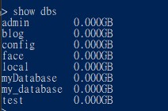

## Mongo 常見語法

* 顯示database有哪些

```
$ show dbs
```


* 進入db，在使用use時，如果沒有此資料庫則自動創建

```
$ use test_database
```

* 刪除資料庫
    - 必須先使用use 進入
```
> use test_database
> db.dropDatabase()
```

* 顯示有哪些table，在mongo裡面叫做collections
    * show collections 與 tables 都是互通的!!
```
> show collections
> show tables
```

* 創建collections
    * 參數[capped]:為true，如果超過size則會覆蓋掉前面的資料，如果加此參數會無法update，需要小心使用
    * 參數[size]:需搭配capped,無法單獨使用
    * 參數[max]:可單獨使用，能夠紀錄最大的數量
```
> db.createCollection("admin", {capped:true, size:100000})
```


* 刪除collections

```
> db.admin.drop()
```

* 插入資料 insert
    * 可使用insert 或是 save
```
> db.admin.insert({"name":"admin"})
> db.admin.save({"name":"admin"})
```

* 插入多個資料

```
> db.collection.insertMany([])
```


* 更新資料

```
> db.admin.update({"name":"admin"},{"name":"cool"})
```

* 刪除資料

```
> db.admin.remove({"name":"cool"})
WriteResult({ "nRemoved" : 1 })
```

* 找尋資料
    * 第一個參數是比對 如為空則將collections全部資料顯示出來
    * 第二個參數是顯示哪些內容，像是sql裡的selete name
```
> db.admin.insert({"name":"admin","password":"password"})
> db.admin.find({})
{ "_id" : ObjectId("5fe476a5d44654d3aa884d8a"), "name" : "admin", "password" : "password" }
> db.admin.find({},{"name":1})
{ "_id" : ObjectId("5fe476a5d44654d3aa884d8a"), "name" : "admin" }
```

* 條件比較符號
    * (>)大於-$gt
    * (<)大於-$lt
    * (>=)大於等於-$gte
    * (>=)小於等於-$lte

```
> db.table.save({num:10,data:"hello"})
WriteResult({ "nInserted" : 1 })
> db.table.save({num:5,data:"cool"})
> db.table.find({})
{ "_id" : ObjectId("5fe4782c8e4027527567e4c9"), "num" : 10, "data" : "hello" }
{ "_id" : ObjectId("5fe478398e4027527567e4ca"), "num" : 5, "data" : "cool" }
> db.table.find({num:{$gt:8}})
{ "_id" : ObjectId("5fe4782c8e4027527567e4c9"), "num" : 10, "data" : "hello" }
```


* 限制找尋幾筆資料(limit)
```
> db.table.find({}).limit(1)
{ "_id" : ObjectId("5fe4782c8e4027527567e4c9"), "num" : 10, "data" : "hello" }
```

* 跳過幾筆資料(skip)
    * 常見是使用limit 搭配skip 可以做到像是blog中只找尋幾筆post來顯示
```
> db.table.find({}).limit(1).skip(1)
{ "_id" : ObjectId("5fe478398e4027527567e4ca"), "num" : 5, "data" : "cool" }
```

* 排序
    * key:1 為從小到大，-1則大到小
```
> db.table.find({}).sort({num:1})
{ "_id" : ObjectId("5fe478398e4027527567e4ca"), "num" : 5, "data" : "cool" }
{ "_id" : ObjectId("5fe4782c8e4027527567e4c9"), "num" : 10, "data" : "hello" }
> db.table.find({}).sort({num:-1})
{ "_id" : ObjectId("5fe4782c8e4027527567e4c9"), "num" : 10, "data" : "hello" }
{ "_id" : ObjectId("5fe478398e4027527567e4ca"), "num" : 5, "data" : "cool" }
```

* 建立索引
    * 建立索引可以使資料表一開始就做好排序，使得搜尋速度較為快速

```
> db.table.createIndex({num:1})
```

* 聚合(aggregate)
    * 常用可搭配$min,$sum,$max,$avg

```
> db.col.find({})
{ "_id" : ObjectId("5fe47e1d62256982c4e6cc7f"), "title" : "linux", "price" : 100 }
{ "_id" : ObjectId("5fe47e2a62256982c4e6cc81"), "title" : "linux", "price" : 500 }
{ "_id" : ObjectId("5fe47e3362256982c4e6cc82"), "title" : "node.js", "price" : 500 }
{ "_id" : ObjectId("5fe47e3e62256982c4e6cc83"), "title" : "node.js", "price" : 300 }
{ "_id" : ObjectId("5fe47e4662256982c4e6cc84"), "title" : "html", "price" : 1000 }
```

計算各種title的數量

```
> db.col.aggregate([{$group:{_id:"$title",count:{$sum:1}}}])
{ "_id" : "html", "count" : 1 }
{ "_id" : "node.js", "count" : 2 }
{ "_id" : "linux", "count" : 2 }
```

計算同個title的price平均

```
> db.col.aggregate([{$group : {_id : "$title", num_tutorial : {$avg : "$price"}}}])
{ "_id" : "html", "num_tutorial" : 1000 }
{ "_id" : "node.js", "num_tutorial" : 400 }
{ "_id" : "linux", "num_tutorial" : 300 }
```


## 參考資料:https://www.runoob.com/mongodb/mongodb-tutorial.html